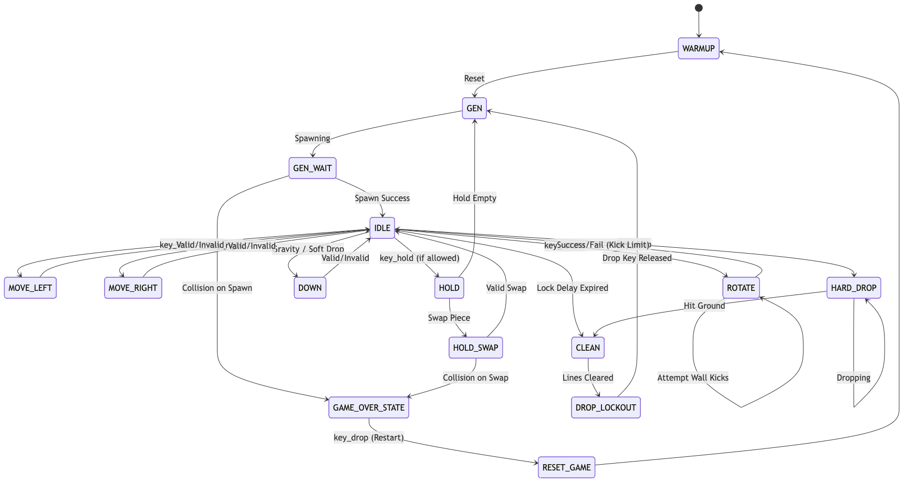

# AG-Tetris: FPGA Tetris Implementation

A fully-featured Tetris game implemented in SystemVerilog for the Artix-7 FPGA (Nexys A7-100T), featuring VGA output at 1280×800 resolution, PS/2 keyboard input, and modern game mechanics.

## Overview

This project implements a hardware-based Tetris game that runs entirely on an FPGA without any processor or software. The design demonstrates key digital logic concepts including:

- **Multi-clock domain architecture** with 5 distinct clock frequencies
- **Pipelined VGA rendering** at 83.46 MHz pixel clock
- **Finite State Machine design** 
- **Clock Domain Crossing (CDC)** with proper synchronization
- **Protocol implementation** (VGA timing, PS/2 keyboard)

## Authors

- **Mohammad Alkhalifah** - [mohammad.alkhalifah@kaust.edu.sa](mailto:mohammad.alkhalifah@kaust.edu.sa)
- **Mustafa Albahrani** - [mustafa.albahrani@kaust.edu.sa](mailto:mustafa.albahrani@kaust.edu.sa)

## Features

### Game Mechanics
- **Super Rotation System (SRS)** with wall kicks for intuitive piece rotation
- **7-Bag Randomizer** ensuring fair piece distribution
- **Ghost Piece** showing where the current piece will land
- **Hold Feature** to swap and save pieces
- **T-Spin Detection** for advanced scoring
- **Delayed Auto Shift (DAS)** for smooth, responsive controls
- **NES-style Scoring** with level progression

### Hardware
- **1280×800 VGA output** at 60Hz refresh rate
- **PS/2 keyboard support** for standard input
- **On-board button fallback** for gameplay without keyboard
- **7-segment display** for debug information

## Architecture

```
┌─────────────────────────────────────────────────────────────┐
│                        game_top                             │
│  ┌──────────┐  ┌──────────────┐  ┌────────────────────────┐ │
│  │ Clock    │  │ Input Layer  │  │    Display Layer       │ │
│  │ Generator│  │              │  │                        │ │
│  │          │  │ PS2Receiver  │  │ vga_out → draw_tetris  │ │
│  │ 100 MHz  │  │ ps2_keyboard │  │ block_sprite           │ │
│  │ 83.46MHz │  │ input_manager│  │ draw_number/string     │ │
│  │ 50 MHz   │  │ debouncer    │  │                        │ │
│  │ 25 MHz   │  └──────────────┘  └────────────────────────┘ │
│  │ 60 Hz    │                                               │
│  └──────────┘  ┌──────────────────────────────────────────┐ │
│                │           Game Logic Layer               │ │
│                │                                          │ │
│                │ game_control (FSM) ← generate_tetromino  │ │
│                │ check_valid, rotate_tetromino, ghost_calc│ │
│                │ clean_field, create_field, spin_detector │ │
│                └──────────────────────────────────────────┘ │
└─────────────────────────────────────────────────────────────┘
```

## FSM 



## Project Structure

```
ag-tetris/
├── game_top.sv              # Top-level module
├── GLOBAL.sv                # Shared constants and definitions
├── src/
│   ├── display/             # VGA and rendering modules
│   │   ├── vga_out.sv
│   │   ├── draw_tetris.sv
│   │   ├── block_sprite.sv
│   │   └── draw_number.sv / draw_string.sv
│   ├── logic/               # Game logic modules
│   │   ├── game_control.sv
│   │   ├── generate_tetromino.sv
│   │   ├── rotate_tetromino.sv
│   │   ├── check_valid.sv
│   │   └── ghost_calc.sv / spin_detector.sv
│   └── input/               # Input processing
│       ├── ps2_keyboard.sv
│       ├── PS2Receiver.sv
│       ├── input_manager.sv
│       └── debouncer.sv
├── test/                    # Testbenches
├── test_logs/               # Simulation logs
├── Schematic/               # Vivado schematic exports
└── alkhalifah_report.tex    # Project report (LaTeX)
```

## How It Works

### Rendering Pipeline
The `draw_tetris` module uses a 4-stage pipeline to determine pixel colors:
1. **Region Detection**: Classify pixel as grid, preview, score, or border
2. **Data Access**: Fetch block data from game board RAM
3. **Sprite Lookup**: Address sprite ROM for 16×16 block textures
4. **Color Output**: Apply piece-type color tinting and output RGB

### Game State Machine
The central FSM in `game_control.sv` manages:
- Piece spawning and 7-bag generation
- Left/right/down movement with collision detection
- Rotation with SRS wall kicks (5 kick attempts per rotation)
- Line clearing with row collapse
- Hold swap with lockout prevention
- Game over detection and reset

## Controls

| Key | Action |
|-----|--------|
| ← → | Move piece left/right |
| ↓ | Soft drop |
| Space | Hard drop |
| Z | Rotate counter-clockwise |
| X / ↑ | Rotate clockwise |
| Left Shift | Hold piece |

## Resource Utilization

Synthesized for Artix-7 (xc7a100t-1csg324c):

| Resource | Used | Available | % |
|----------|------|-----------|---|
| LUT | 25,787 | 63,400 | 40.67% |
| FF | 3,941 | 126,800 | 3.11% |
| BRAM | 0.5 | 135 | 0.37% |
| DSP | 5 | 240 | 2.08% |
| IO | 41 | 210 | 19.52% |


