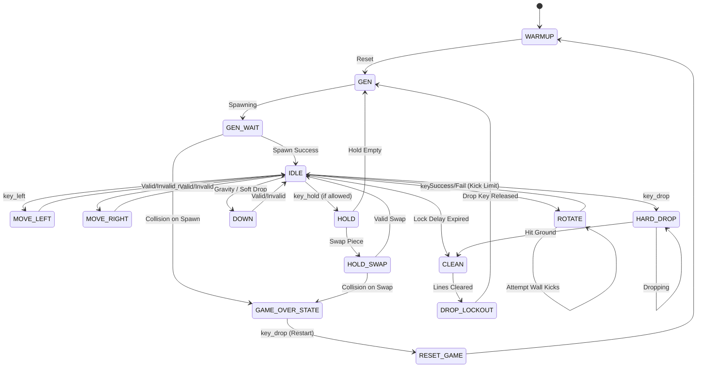

```mermaid
stateDiagram-v2
    [*] --> WARMUP
    WARMUP --> GEN: Reset
    
    GEN --> GEN_WAIT: Spawning
    GEN_WAIT --> IDLE: Spawn Success
    GEN_WAIT --> GAME_OVER_STATE: Collision on Spawn
    
    IDLE --> MOVE_LEFT: key_left
    IDLE --> MOVE_RIGHT: key_right
    IDLE --> ROTATE: key_rotate
    IDLE --> DOWN: Gravity / Soft Drop
    IDLE --> HARD_DROP: key_drop
    IDLE --> HOLD: key_hold (if allowed)
    IDLE --> CLEAN: Lock Delay Expired
    
    MOVE_LEFT --> IDLE: Valid/Invalid
    MOVE_RIGHT --> IDLE: Valid/Invalid
    
    ROTATE --> IDLE: Success/Fail (Kick Limit)
    ROTATE --> ROTATE: Attempt Wall Kicks
    
    DOWN --> IDLE: Valid/Invalid
    
    HARD_DROP --> HARD_DROP: Dropping
    HARD_DROP --> CLEAN: Hit Ground
    
    HOLD --> GEN: Hold Empty
    HOLD --> HOLD_SWAP: Swap Piece
    
    HOLD_SWAP --> IDLE: Valid Swap
    HOLD_SWAP --> GAME_OVER_STATE: Collision on Swap
    
    CLEAN --> DROP_LOCKOUT: Lines Cleared
    
    DROP_LOCKOUT --> GEN: Drop Key Released
    
    GAME_OVER_STATE --> RESET_GAME: key_drop (Restart)
    RESET_GAME --> WARMUP
```
