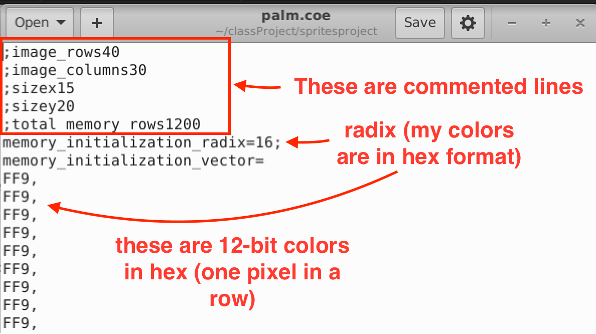
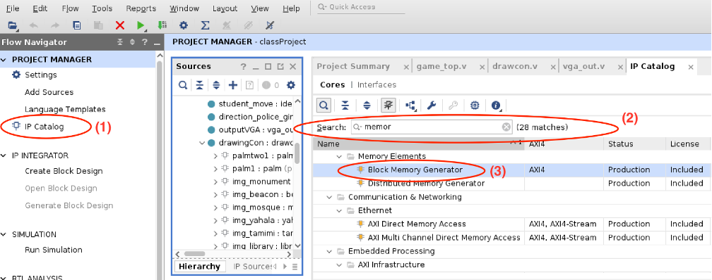
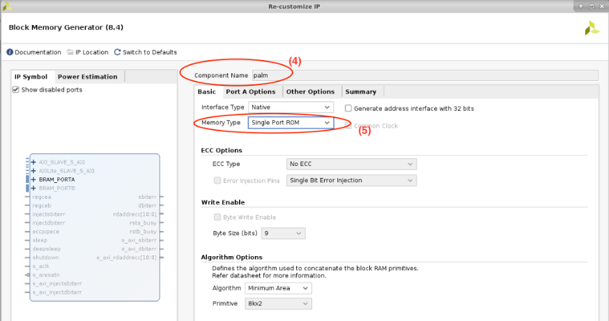
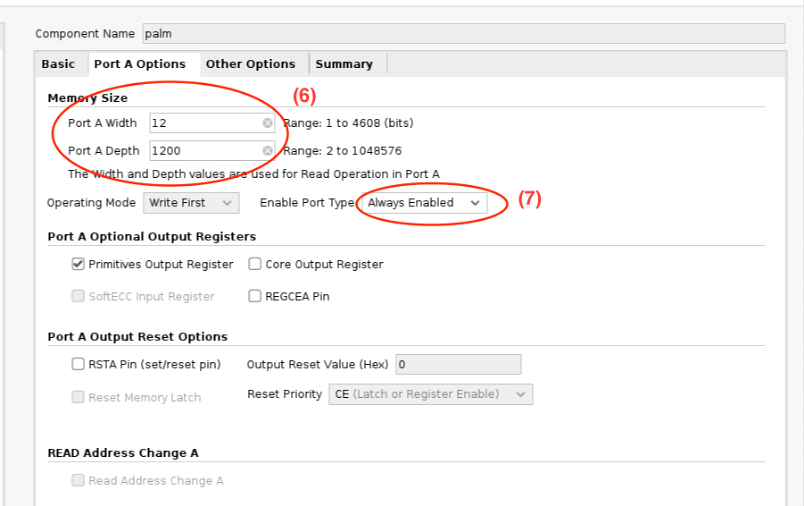
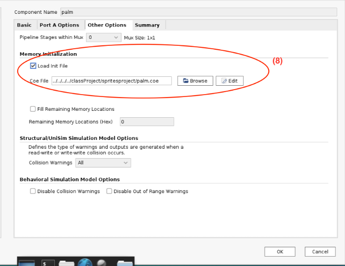
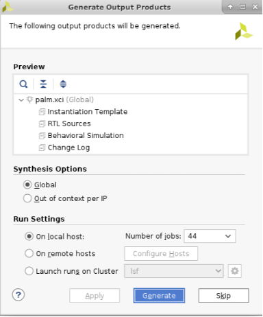
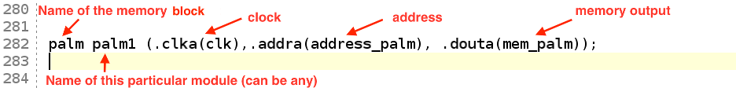
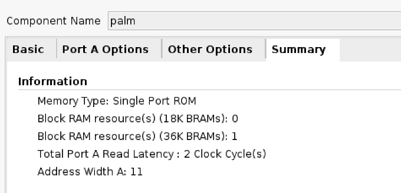

# CS256 Class Project
## Tips on Implementing Sprites

*Thanks to Olga Krestinskaya for preparing this document.*

### What is a sprite?
A sprite is a graphic object (image) that is loaded from memory to be displayed on the screen. There are two ways to add the memory block containing a sprite to your project: either using code or via an automatic memory generator. This document shows how to use Memory Generator in Vivado to allocate the memory for sprites. The file containing the spite used to initialize the memory has a `.coe` extension.

### What is a .coe file and how is it created?
This file determines the contents to be loaded into the memory each time the circuit is initialised on the FPGA. Each pixel of the image is saved in a separate row in the `.coe` file. The image of size of $`N\times M`$ is transformed to the vector of the size of $`NM\times 1`$. It is important to know the initial size of the image and how it was converted to the vector, e.g row-by-row or column-by-column.  The file also provides the radix information representing the format of the saved pixels. For example, if the pixels are saved in hex format, the radix is set to 16.  
An example of a `.coe` file is shown here:

This example is the `.coe` file of the following image. The image is of the size $`40\times 30`$ pixels rescaled row-by-row to a $`1200\times 1`$ vector. The colors are represented by 12-bits corresponding to RGB values (4-bits each).

It should be noted that depending on how you generate your file, your color format and radix might be different. To convert the images to a `.coe` file, you can write simple a Matlab or Python script. Also, there are open-source scripts available. This file will be used to initialise the memory contents. 

### How should Vivado Memory Generator be used?
To generate a memory block using Memory Generator:
1. Go to *IP Catalog*.
2. Search `memory`.
3. Select *Block Memory Generator* from the *Memory Elements* that will appear after searching.

  

  You will see the memory generator IP that you can customize (screenshot below).

4. Rename your memory component (very useful if you have many memory blocks).

  Then you need to select the type of memory you want to create. Usually, for sprites, we select ROM, as we don’t need to write back to the memory, and rather just display images from the memory.

5. Set the memory type as “Single Port ROM”, and leave the other parameters as default (double-check the screenshot below).

  

  Now, you need to define the memory size.

6. Go to the “PortA Options” tab. Set up memory width to the number of bits representing a pixel in your .coe file (12 in our case), and the depth to the number of rows in your image vector (1200 in this case). 
7. Optional: You can also use enable signal for your memory to enable it only when this signal is high. Otherwise, set “Enable Port Type” to “Always Enabled”, as shown below.

  

  Finally, you need to select your `.coe` file to initialize the memory block.  

8. Select the “Other Options” tab. Choose “Load init file”. Select the corresponding file using “Browse”. 

  

Click “OK” after finishing, and the following “Generate Output Products” menu will appear. Click “Generate”. For large images, it might take some time to generate a memory block.

  

### How do I use the sprite memory?
To add the created memory to your code, the following Verilog command can be used:

The name of the memory block is the one assigned when creating the block. The address is the position of the pixel in the memory array. Each row in the `.coe` file has a unique address. Using the address, you can read any memory element (consisting of 12-bits in this case). The `.douta()` port outputs the corresponding 12-bit value.
If you chose to have an enable pin, you also need to add `.ena(EN)` with `EN` replaced with your chosen signal set to 1 when enabled.

### Address tips: 
- The address corresponds to the pixel you currently read. So, it should be related to the currently drawn pixel.
- The address is also related to the desired location of the image (vertical and horizontal position) and its size.
- Make sure that the wordlength of the address is enough to display all memory elements in the memory array. In the “Summary” tab in “Block Memory Generator”, you can see the required address width (below).

  

### Potential timing issues
Usually, it takes more than one clock cycle to read the memory. In the example above, the read memory latency is 2 clock cycles (common for ROM). This means that you need to start reading the corresponding pixel 2 clock cycles earlier, than displaying it. Otherwise, an unwanted delay will occur. 
